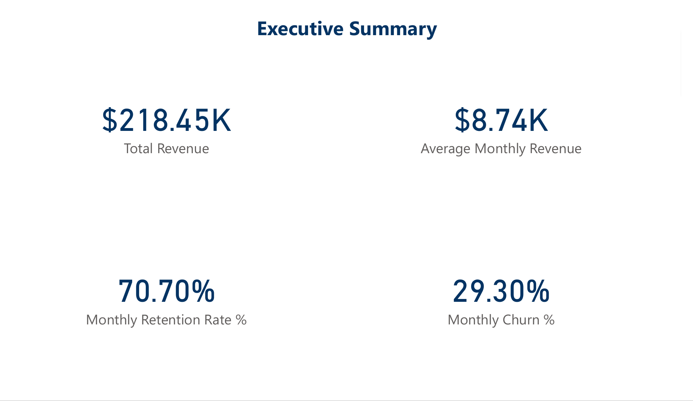
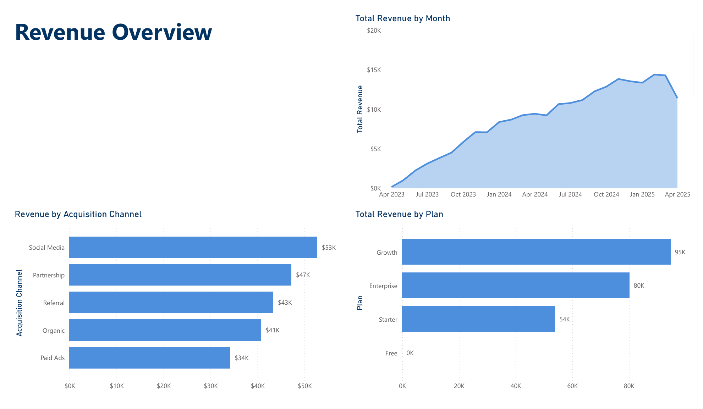
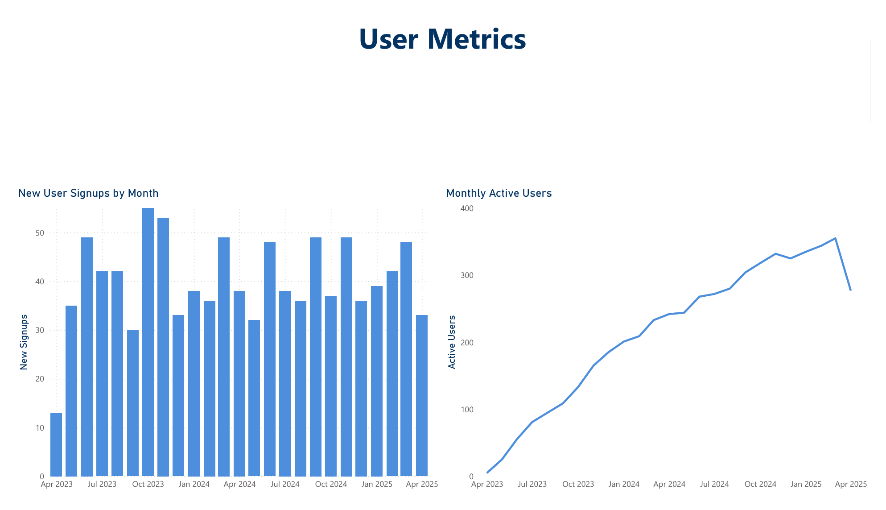
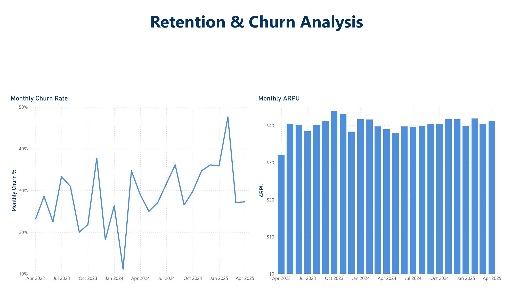

# SaaS Revenue & User Metrics Dashboard  

A subscription analytics dashboard built with **SQL + Power BI**, designed to simulate how SaaS companies track **revenue, churn, retention, and acquisition channels**.  

This project demonstrates my ability to translate a business problem into data modeling, KPI design, and dashboard storytelling for decision-making.  

---

## 🔎 Context  
SaaS businesses rely on recurring revenue and user retention. Without clear visibility into revenue streams, churn, and acquisition performance, leaders can’t make data-driven product or strategy decisions.  

This project showcases how a centralized dashboard can highlight performance trends and risks using mock SaaS data.  

---

## 📊 Key Metrics  
- **$218.45K** Total Revenue  
- **$8.74K** Avg. Monthly Revenue  
- **70.7%** Monthly Retention Rate  
- **29.3%** Monthly Churn  

---

## 📷 Dashboard Preview  

**Executive Summary**  
  

**Revenue Overview**  
  

**User Metrics**  
  

**Retention & Churn Analysis**  
  

📑 [Download Full Dashboard (PDF)](deliverables/saas_revenue_user_metrics_dashboard.pdf)  

---

## 💡 Key Insights  
- **Churn spikes after 3 months** → signals need for stronger onboarding & engagement.  
- **Social Media drives $53K in revenue**, but **Partnerships convert more efficiently**.  
- **Growth Plan contributes ~44% of revenue**, outperforming Enterprise in volume.  
- **MAUs trend upward**, but retention dips in late 2024 suggest product stickiness challenges.  

---

## 🛠️ Tools & Skills  
- **SQL** for data preparation & cohort queries  
- **Power BI (Desktop)** for modeling, DAX measures, and dashboard design  
- **Business Analysis**: revenue forecasting, churn modeling, channel ROI  
- **Data Storytelling**: presenting metrics in an executive-ready format  

---

## 📂 Repository Contents  
- **data/** → CSVs simulating SaaS users, subscriptions, payments, and plans  
- **sql/** → SQL queries used for KPI calculation and data preparation  
- **visuals/** → PNG screenshots of dashboard views  
- **deliverables/** → PDF export of full dashboard  
- **README.md** → Project documentation  

---

## 📖 How to Use  
1. Open the CSV files in your preferred BI tool (Power BI, Tableau, Looker Studio, Excel).  
2. Use the provided SQL (`sql/saas_revenue_user_metrics.sql`) to recreate KPIs like revenue, churn, and retention.  
3. View screenshots or the PDF for insights without requiring Power BI service access.  

---

## 🚀 Skills Demonstrated  
✔ End-to-end project delivery (data → modeling → visualization → insights)  
✔ KPI design and calculation (MRR, ARPU, Retention, Churn)  
✔ Executive-level dashboarding for decision support  
✔ Communicating technical insights in business language  

---
